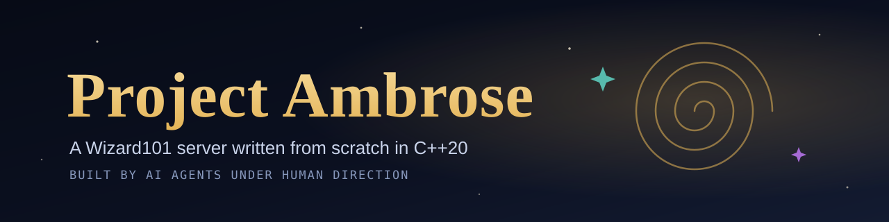
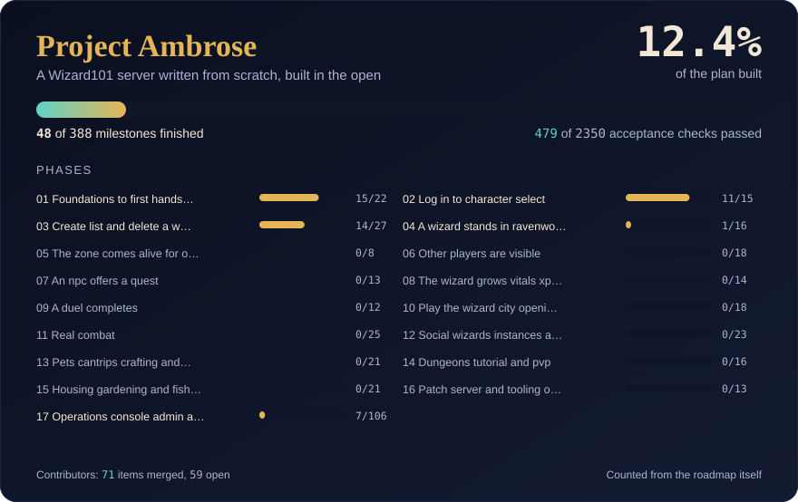

<!-- Project Ambrose by Imjustchico: Project overview, status, building, contributing, community, ground rules, licence and disclaimer. -->
<div align="center">



[](LICENSE)
[](doc/ARCHITECTURE.md)
[](doc/UI-STACK.md)
[](https://discord.gg/Dx6ACDUj6N)
[](https://www.reddit.com/r/ProjectAmbrose/)

[](https://github.com/Justchicoo/Project-Ambrose/actions/workflows/core-build.yml)
[](https://github.com/Justchicoo/Project-Ambrose/actions/workflows/front-end.yml)
[](#building)
[](doc/progress/)
[](doc/CONTRIBUTOR-TRACK.md)

**[Roadmap](doc/ROADMAP.md)** &nbsp;·&nbsp; **[Architecture](doc/ARCHITECTURE.md)** &nbsp;·&nbsp; **[Panel](doc/PANEL.md)** &nbsp;·&nbsp; **[Work board](https://justchicoo.github.io/Project-Ambrose/)** &nbsp;·&nbsp; **[Contribute](doc/CONTRIBUTOR-TRACK.md)** &nbsp;·&nbsp; **[Milestones](doc/MILESTONE-TRACK.md)** &nbsp;·&nbsp; **[Start with your AI](contrib/AI-START-HERE.md)** &nbsp;·&nbsp; **[Discord](https://discord.gg/Dx6ACDUj6N)**

</div>

---

The experiment is simple: see how far AI-driven development can take a complete game server. Humans set direction and review; AI agents write the code. Nothing here is copied from another emulator, and nothing extracted from the game client is ever committed.

> [!NOTE]
> **Pre-alpha.** A real Wizard101 client, started by Ambrose's own launcher, talks to the servers as far as character select, and each server shows itself live in its own web panel. It stops there.

## Where the project is

<div align="center">



</div>

The card is generated from the roadmap itself by `apps/progress/progress.py`, so it cannot drift from what is built: a milestone counts when every one of its acceptance checks is ticked. [doc/progress/progress.json](doc/progress/progress.json) holds the same numbers for anything that wants to read them, and the panel and the Discord announcement both use it.

## What runs today

| Working | Not yet |
|---|---|
| Session handshake against a retail client | World, zones and movement |
| Signing in, a wrong password, and a retry | Quests, combat, pets, housing |
| The character list, and the shutdown notice | Character creation end to end |
| Ambrose's own launcher starting the client | Panel accounts, roles and the pages after the overview |
| Type extraction from your own installation | Patch serving |
| The admin API: health, status, and a live log stream with secrets hidden | |
| The panel's overview, served by each server and signed in once | |

[doc/ROADMAP.md](doc/ROADMAP.md)'s **Where we are** says exactly which milestones are done. The plan runs in **17 phases**, each milestone ending in something visible in the real client or the panel.

## Building

> [!TIP]
> You need CMake 3.25+, vcpkg with `VCPKG_ROOT` pointing at it, and a C++20 compiler: Visual Studio 2022+ on Windows or GCC 13+ on Linux. vcpkg installs every library on the first configure, which takes a while exactly once.

<details open>
<summary><b>Windows</b></summary>

```bat
cmake --preset windows-msvc-x64
cmake --build --preset windows-debug
cd build\windows-msvc-x64\bin\Debug
copy gameserver.conf.dist gameserver.conf
gameserver.exe
```

</details>

<details>
<summary><b>Linux</b></summary>

```bash
cmake --preset linux-gcc
cmake --build --preset linux-gcc-debug
cd build/linux-gcc/bin/Debug
cp gameserver.conf.dist gameserver.conf
./gameserver
```

</details>

The build copies `gameserver.conf.dist` next to the executable. The server reads `gameserver.conf` from the folder it runs in, logs to the console and to `logs/Server.log`, and exits with an error naming the missing file if there is none. Options are described in [doc/config/gameserver.md](doc/config/gameserver.md) and [doc/config/logging.md](doc/config/logging.md).

<details>
<summary><b>Tests, sanitizers and release builds</b></summary>

Run the unit tests with the test preset matching your build, for example `ctest --preset windows-debug` or `ctest --preset linux-gcc-debug`. Configure with `-DBUILD_TESTING=OFF` to skip the tests and their dependencies. Use `windows-release` or `linux-gcc-release` for optimized builds.

On Linux, `linux-gcc-asan` builds and tests with AddressSanitizer and UndefinedBehaviorSanitizer, `linux-clang-tsan` does the same with ThreadSanitizer, and `linux-clang-fuzz` builds the libFuzzer targets for decoders of untrusted data and runs each from its seed corpus. Each needs the matching compiler installed, and ThreadSanitizer may need `sudo sysctl vm.mmap_rnd_bits=28` on newer kernels.

Hosted CI builds the Windows leg on Sundays and Wednesdays, the sanitizer legs on Sundays, and the GCC, Clang and fuzz legs on the first Sunday of each month, each only when code changed since its last build. Any leg can also be built on demand; see Continuous integration in [doc/ARCHITECTURE.md](doc/ARCHITECTURE.md).

</details>

## Contributing

There are two doors, and every pull request through either is verified by running it, not by reading it.

The **contributor track** has its own folders and cannot collide with a milestone in flight: findings, tools, schemas, fixtures, guides and proposals. The **milestone track** is the roadmap itself, a named set of milestones open to outside help, with the source tree and the acceptance checks that come with them. Everything not named there is reserved, because the maintainer's own agents are building it.

| | |
|---|---|
| **59 open items** | [doc/CONTRIBUTOR-TRACK.md](doc/CONTRIBUTOR-TRACK.md) - findings about the game, and tools, schemas, fixtures, guides and proposals, each with what it needs and how it is proven |
| **Start in one paste** | [contrib/AI-START-HERE.md](contrib/AI-START-HERE.md) - a prompt for any AI assistant, with everything it needs to work here without guessing |
| **What is free to take** | [The work board](https://justchicoo.github.io/Project-Ambrose/) - generated from the roadmap and the open pull requests: what is being built right now, by whom, and which milestones anyone can take. Its [state.json](https://justchicoo.github.io/Project-Ambrose/state.json) is the same thing for your AI |
| **Build a milestone** | [doc/MILESTONE-TRACK.md](doc/MILESTONE-TRACK.md) - the rules behind the board, and [contrib/AI-MILESTONES-HERE.md](contrib/AI-MILESTONES-HERE.md), the prompt that goes with them |
| **The shape of a finding** | [contrib/findings/README.md](contrib/findings/README.md) - one claim about how the game behaves, written so it can be proven or refuted |
| **House rules** | [CONTRIBUTING.md](CONTRIBUTING.md) - AI-written changes are expected, not merely allowed |

The most valuable thing anyone can add is a **proven finding**: Ambrose is built only on data it has re-derived itself, and every finding is verified or refuted before a milestone is built on it. A finding that turns out false is still worth sending, because it stops the next person chasing it.

## Community

| | |
|---|---|
| **Discord** | [discord.gg/Dx6ACDUj6N](https://discord.gg/Dx6ACDUj6N) - questions as they come up, and every merge as it lands |
| **Reddit** | [r/ProjectAmbrose](https://www.reddit.com/r/ProjectAmbrose/) - longer threads and announcements |
| **Bugs and ideas** | [Issues](https://github.com/Justchicoo/Project-Ambrose/issues/new/choose) - a form for each |
| **Security** | [SECURITY.md](SECURITY.md) - report privately, never in a public issue |
| **Conduct** | [CODE_OF_CONDUCT.md](CODE_OF_CONDUCT.md) - one standard in the repository, on Discord and on Reddit |

## Ground rules

- **From scratch.** Other projects may be studied for structure and behaviour. No code is copied, translated or ported, and none of their data files are committed.
- **No game files, ever.** Tools read game data from a user's own installation at runtime. Nothing extracted from the client enters this repository.
- **AzerothCore's shape.** The structure and development methods follow it; see [doc/ARCHITECTURE.md](doc/ARCHITECTURE.md).
- **One look everywhere.** [doc/DESIGN.md](doc/DESIGN.md) sets the palette, type and motion for every surface, down to the colour of a log line; [doc/UI-STACK.md](doc/UI-STACK.md) is what they are built with.
- **Proven, or it does not ship.** Every claim says how it was checked and what would prove it wrong.

## Licence

MIT ([LICENSE](LICENSE)). The licence covers the code and documents in this repository. It does not cover Wizard101 or any KingsIsle Entertainment property: no game file, asset or text is included here, and every tool reads a user's own installation at run time. [THIRD-PARTY-NOTICES.md](THIRD-PARTY-NOTICES.md) lists the libraries this software uses and what each one requires, including the two that ask for more than attribution.

---

<div align="center">

**Project Ambrose is a fan-made research project.**

It is not affiliated with, endorsed by, or connected to KingsIsle Entertainment.<br>
Wizard101 is a trademark of KingsIsle Entertainment, Inc.

[](https://discord.gg/Dx6ACDUj6N)

</div>
